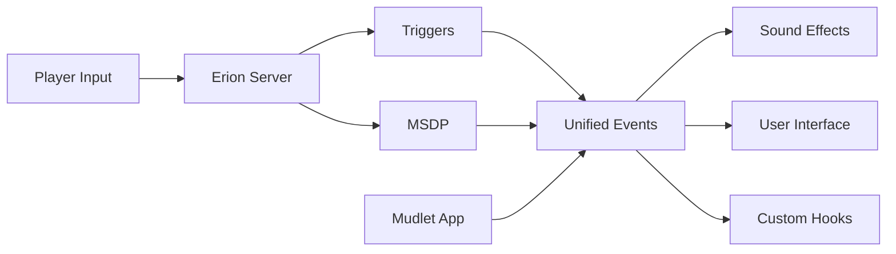

<!-- markdownlint-configure-file { "MD013": { "line_length": 800 } } -->

# Erion Deluxe

Erion Deluxe is a set of packages designed to enhance Erion both out of the box and as an easy to extend foundation.

Planned Feature:
- Easy to reference set of events to build features from.
- Full set of UI components. Chat window, minimap, stats, etc.
- Complete translation of sound pack from MUSH Client
- Easy to configure through commands
- Fully accessible to visually impaired players

## Status

This package is not ready to be used by an average player just looking to play. It should always be stable and not break anyone's experience if they choose to check it out.

### Checklist

- [ ] Code Foundation ~ 50%
- [ ] Event Unification ~ 5%
- [ ] Sound Effects ~ 5%
- [ ] Music ~ 0%
- [ ] UI ~ 0%
- [ ] Commands ~ 0%

## Structure

This repository is broken up into two Mudlet packages. It's done this way because the soundpack is over a gig and some people might not want sounds at all.

- ErionClient
- ErionSoundpack

It might make sense to add the UI features to ErionClient or it might make more sense to create another package. At the time of writing there are no UI features.

### Events

Building a client for Erion and many other MUDs is challenging because triggers have to be created using pattern matching or regular expressions. Erion also partially uses MSDP events. The core of this package unifies triggers and these events into one cohesive set of events that everything else can be built from.

Events are defined in `ErionClient/src/scripts/ErionClient/events.lua` at the bottom of the file.

#### Event Names

Event names are taken directly from the MUSHClient soundpack wish serves as a sort of baseline enumeration of all the events of the game. They're added to a hierarchical structure to make it a little easier to find and reference them.

For example:

| Original Name | Event String                    | Event Object                         |
| ------------- | ------------------------------- | ------------------------------------ |
| pickaxe       | 'erion.crafting.mining.pickaxe' | erion.events.crafting.mining.pickaxe |

## Contributing

This package uses muddler to make development and collaboration easier.

TODO: Describe muddler setup.

This package was originally made on Mac and Linux so there are scripts that are currently written in bash. Windows will not be able to use those so I'd like to rewrite those scripts in lua since that language should be usable by any contributors.

### Challenges

So far, two issues with Mudlet have been identified that present technical Challenges.
- MacOS doesn't support the ogg file format and Mudlet uses the system sound. This means that audio files need to be translated to another format like mp3.
- Mudlet doesn't support fading sounds to different channels. The MUSHClient soundpack plays player sounds in one ear and monster sounds in the other ear. The most straight forward solution would be to make different sounds.

## Alternatives

There are two alternatives available. Those options are detailed on the main [main Erion site](https://www.erionmud.com/client.php). In brief there is:

- [MUSHClient soundpack](https://www.erionmud.com/blindsupport.php) - This is a sound pack extension for MUSHlient.
- [ErionUI](https://github.com/Caelinus/ErionMud-UI) - A minimal UI extension for Mudlet.

## Motivation

Modern gamers who might be incline to play Erion or MUDs in general tend to be put off by a pure text interface. Erion is already ahead of the curve, but enriching the client by bringing these two packages together will make the game more approachable and fun without sacrificing what makes muds special.

Additionally, Mudlet is a great client with a lot of power, but a lot of quirks as well. Building something meaningful is challenging. Hopefully this package can make custom triggers a little more approachable.

